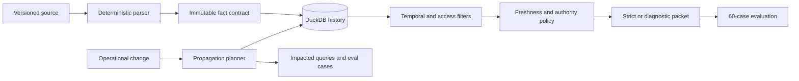

# Architecture

## Scope

This repository is a correctness-oriented reference service for operational facts.
It is deliberately smaller than an enterprise knowledge graph: V1 uses synthetic
data, deterministic retrieval, DuckDB, and no production write capability.

## Data flow

## Contracts

A fact carries its subject, predicate, typed value, immutable source version,
source digest, observed time, valid interval, recorded time, authority, review
state, environment, service scope, sensitivity, and freshness policy. Confidence
is descriptive metadata and cannot override source authority or freshness.

Source versions are immutable by `(source_id, version)`. Reusing that identity
with different content is rejected. Corrections, supersessions, contradictions,
and invalidations append records rather than deleting history.

## Retrieval order

1. Match service, environment, type, incident, release, and predicate.
2. Remove facts recorded after the question time.
3. Enforce access scopes.
4. Apply supersession as it was known at the question time.
5. Evaluate validity, soft review, hard expiry, event invalidation, and authority.
6. Preserve equal-authority conflicts as `disputed`.
7. Rank admissible evidence using deterministic keyword overlap.
8. Return source-version citations and decision reasons.

Strict mode returns only current admissible evidence. Diagnostic mode exposes
accessible stale, superseded, or disputed candidates and explains exclusion.

## Evaluation

The packaged corpus contains eight services, fifteen incidents, and sixty
point-in-time questions covering current, stale, disputed, unknown, and
insufficient-evidence outcomes. The same cases run against:

- `naive_text`: latest matching text without temporal validity;
- `current_keyword`: recorded-time and validity filtering without freshness or conflict;
- `temporal_provenance`: the complete policy and citation pipeline.

The gate checks temporal state accuracy, baseline improvement, unsupported
answers, correct abstention, stale-fact use, conflict recognition, and citations.

## Deployment boundary

PostgreSQL, full-text search, pgvector, and a Go read API are intentionally
deferred. Add them as adapters around these tested contracts. Do not reimplement
policy semantics independently in each transport or storage backend.
